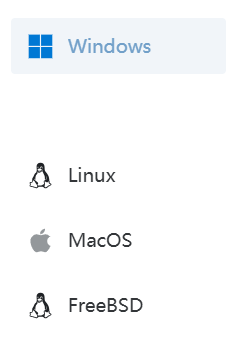
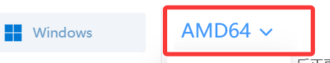

# 如何手动下载Frpc
> ！以下方法你需要一定的电脑基础。**请在尝试过此wiki中其他页面的方法且但无任何效果后在使用此方法！**  
> ！**此方法适用于`1.0.1及以后`的版本**！

## 手动下载Frpc

1. 打开[OpenFrp下载界面](https://console.openfrp.net/download)； 

2. 选择你所使用的电脑系统；  
3. 在中选择电脑所使用的框架。**不要选择`启动器正式版`**；  
> 若不知道下载哪一个，参考[如何查看自己电脑框架](../../解决办法/CheckStructure)；  
4. 点击右下方的`下载`；  
5. 等待下载完成后对下载文件进行`解压`得到Frpc文件；  
6. 在游戏界面中点击`打开存储文件夹`，并将下载得到的Frpc文件移动到打开的文件夹中；  
7. **将你下载的Frpc运行一次，然后将其关闭** ，检查是否有`frpc.json`文件生成，若有则可进行下一步，若没有生成文件，请参考[如何手动创建`frpc.json`文件](../../解决办法/WritejsonByHand)；
8. 重新启动游戏。  

若以上方法仍然无法解决，请参考[如何上报问题](../Report)对问题进行上报。