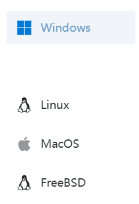

# 如何手动创建`frpc.json`文件

> ！以下方法你需要一定的电脑基础。**请在尝试过此wiki中其他页面的方法且但无任何效果后在使用此方法！**  
> ！**此方法适用于`1.0.1及以后`的版本**！

1. 打开[OpenFrp下载界面](https://console.openfrp.net/download)； 

2. 选择你所使用的电脑系统；  
3. 在中选择电脑所使用的框架。**不要选择`启动器正式版`**；  
> 若不知道是哪一个，参考[如何查看自己电脑框架](../../解决办法/CheckStructure)；  
4. 点击右下方的`复制链接`；  
5. 将复制内容粘贴到任意位置，接下来步骤将以`0.61.1`版本为例：
> 1. 复制链接得到`https://r.zyghit.cn/client/OF_0.61.1_4df06100_250122/frpc_windows_amd64.zip`；
> 2. 链接中的`0.61.1`为当前frpc版本号。
6. 在存放你下载frpc文件的位置创建一个.json文件然后用文件编辑器打开；  
> [如何用记事本建立Json格式文件](https://blog.csdn.net/weixin_43704737/article/details/88619057)
7. 在其中下入：
`{"version":"当前frpc版本号"}`
后保存文件；
8. 重新进入游戏。

若以上方法仍然无法解决，请参考[如何上报问题](../Report)对问题进行上报。